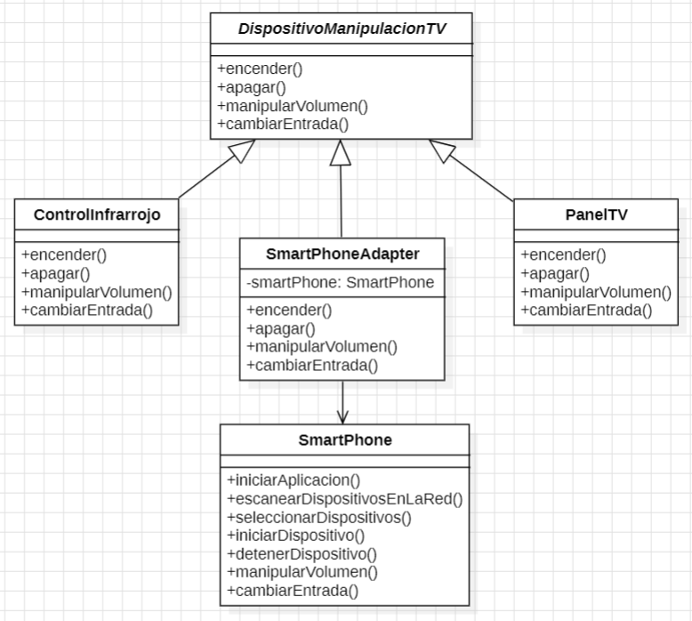

# PATRON ADAPTER

En este ejercicio se dio un diagrama UML en el cual se identifico un problema, que podia ser resuelto utilizando el patron estructural ADAPTER.

El patron Adapter es un patron estructural que permite que objetos de interfaces incompatibles trabajen juntos.

En este caso, se utilizo una clase Adaptadora **SmartPhoneAdapter** la cual adapto la clase **SmartPhone** a la implementacion de **DispositivoManipulacionTv**. De esta manera la clase SmartPhone puede trabajar con DispositivosManipulacionTV. 

 Se implemento y se creo el siguiente diagrama UML como resultado.

## HERRAMIENTAS
- StarUML
- Visual Studio Code
